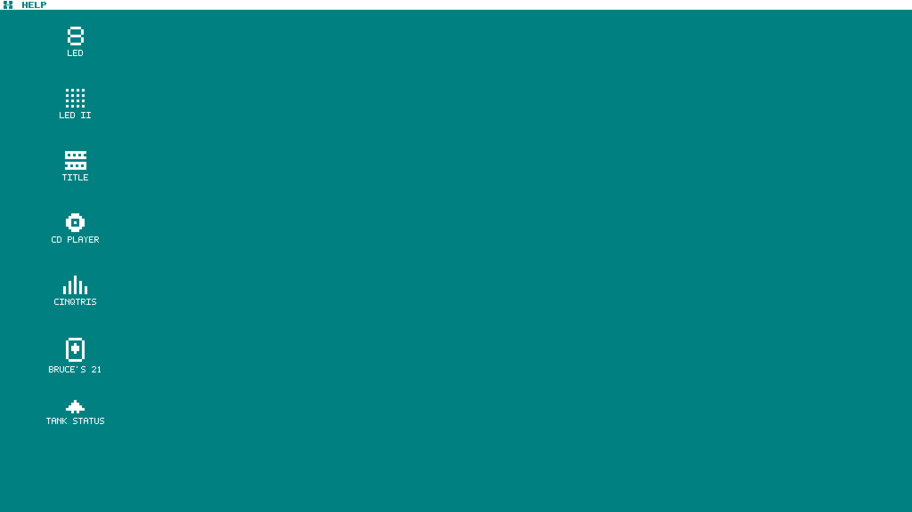
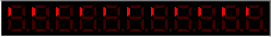
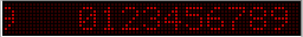
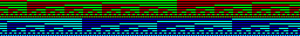
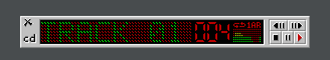
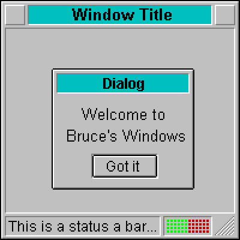
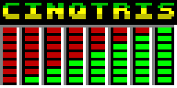
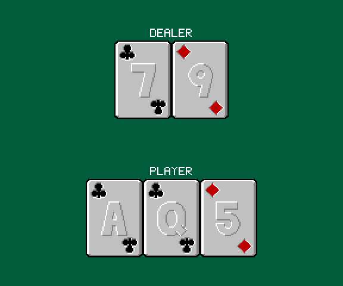
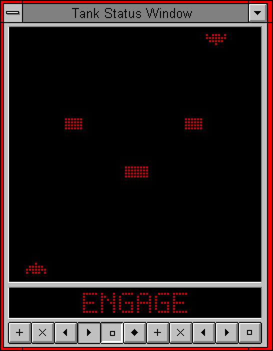

# Retro demos

These are some demos based on programs I wrote in the early 1990s for the Atari ST and early Windows machines.



Each image in `images/` is a screenshot of one original program. Most map to their own demo app; a few closely related images (e.g. a title screen and its asset sheet) share a single demo. See `demos.md` for the full list and groupings. The demos are written in pygame-ce, and all of them share one command-line interface and one set of in-demo keybindings.

## Screenshots

| | | |
|---|---|---|
| **LED** <br> `led` <br>  | **LED II** <br> `led_ii` <br>  | **Title** <br> `title` <br>  |
| **CD Player** <br> `cd_player` <br>  | **Bruce's Windows** <br> `bruces_windows` <br>  | **Cinqtris** <br> `cinqtris` <br>  |
| **Bruce's 21** <br> `bruces_21` <br>  | **Tank Status Window** <br> `tank_status_window` <br>  | |

Regenerate these with `SDL_VIDEODRIVER=dummy .venv/bin/python scripts/capture_screenshots.py` (see that script's own docstring) whenever a demo's visuals change enough to be worth re-capturing.

## Setup

Requires Python 3 and pygame-ce.

```bash
python3 -m venv .venv
.venv/bin/pip install -r requirements.txt
```

## Running a demo

```bash
# Open the desktop shell (the root interface -- click an icon to open a demo)
.venv/bin/python -m retrodemos

# List available demos
.venv/bin/python -m retrodemos --list

# Run one demo standalone, full-window, no desktop chrome
.venv/bin/python -m retrodemos <name>
```

### Options

| Flag | Default | Description |
|---|---|---|
| `--scale N` | 3 | Integer scale factor from native pixel resolution to window size. Shrunk automatically (down to 1x) if the requested scale wouldn't fit the screen -- the desktop shell's 1024x576 canvas is the common case this catches. |
| `--fps N` | 60 | Frame rate cap |
| `--fullscreen` | off | Run fullscreen |

## Controls

Every demo shares these keybindings:

| Key | Action |
|---|---|
| Esc / Q | Quit |
| Space | Pause / resume |
| R | Restart |

The desktop shell (`python -m retrodemos` with no name) adds its own controls: click an icon to open that demo as a window, drag its title bar to move it, click the close button to shut it, click a window to bring it to front. An open demo's icon dims rather than disappearing while its window is open, except Bruce's Windows' own icon, which is hidden entirely (a demo of windowing chrome reads as redundant on a desktop that's itself a real windowing system). A macOS-style menu bar sits across the top: click the ⌘ icon for About / Close All Windows / Quit; the bar names whichever window is focused, or reads "HELP" (click it for a quick-reference panel) when nothing is. Some demos add their own controls when run standalone: Bruce's Windows ("Got it" closes its dialog), CD Player (its one window is draggable, and clicking its body cycles the repeat/shuffle status indicator), Tank Status Window (its minimize box doubles as a close control), and Cinqtris (click anywhere to slide "MADMAX" across the screen and off the far edge). See each demo's spec in `docs/` for details.

## Project docs

- `PLAN.md`: architecture, shared framework design, and build order.
- `demos.md`: per-demo spec and build status.
- `docs/`: one mini-spec per demo.
